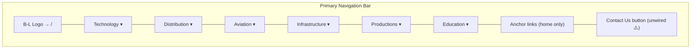
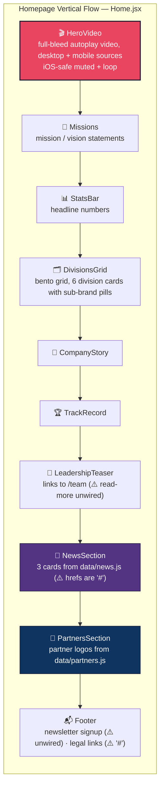
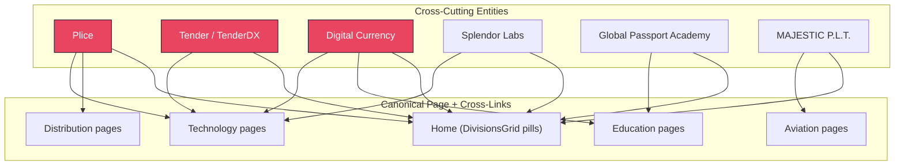

# B&L Worldwide — Website Information Architecture

> **Purpose**: This document is the living reference for the B&L Worldwide corporate website. It began as the rebuild blueprint derived from the 33 extracted WordPress content pages; it now also tracks the **as-built** state of the new React site so the two can be compared at a glance.
>
> **Status**: 🟢 **LIVE** at <https://b-lworldwide.web.app> (Firebase Hosting) — last shipped story: iOS hero-video autoplay/loop fix, 2026-07-17.

---

## 0. Build Status Snapshot (as of 2026-07-17)

| Item | State |
|---|---|
| **Stack** | Vite 8 · React 19 · React Router 7 · Tailwind CSS 4 · lucide-react |
| **Hosting** | Firebase Hosting, SPA rewrite `** → /index.html`, project `b-lworldwide` |
| **CI/CD** | GitHub Actions `firebase-deploy.yml` — deploys on push to `main` |
| **Routes built** | **33 of 33** planned content routes (see §12) |
| **Division landings** | All 6 built — including the 3 (Distribution, Infrastructure, Education) that the old WordPress site never had |
| **Homepage** | Fully redesigned section stack (see §5) — the old accordion layout is retired |
| **Hero** | Autoplaying background video, separate desktop/mobile MP4s (`/assets/hero-desktop.mp4`, `/assets/hero-mobile.mp4`, 16 MB each), programmatic `muted`/`loop` for iOS |
| **Not built** | VTOL/Drones sub-page · Multilingual · `/news` route · 404 page · site search |
| **Unwired** | Contact form submit · newsletter Subscribe · navbar "Contact Us" button · hero CTAs · footer social/legal links (see `_01_My/Docs/link_map.md` for the authoritative wire-up tracker) |

### Recent story log

| Date | Story | Outcome |
|---|---|---|
| 2026-07-17 | Fix hero video autoplay on iOS | `video.loop = true` set programmatically in `HeroVideo.jsx`; merged + deployed live |
| 2026-07-16 | Firebase Hosting deploy workflow (#1, #2) | CI deploy on `main` push; `package-lock.json` synced so `npm ci` passes |
| earlier | Full site build-out | 33 routes, redesigned homepage, division landings, data-driven nav/news/partners |

---

## 1. Brand Identity & Positioning

| Attribute | Value |
|---|---|
| **Company** | B & L Worldwide Holding Companies |
| **Tagline** | "Distribution Logistics and technology that connect continents" |
| **Sub-tagline** | "Invest Locally, Think Globally — Customized Business Solutions" |
| **HQ** | 1314 East Las Olas Blvd, Ft Lauderdale, FL 33301 |
| **Phone** | (561) 400-0465 |
| **Email** | info@b-lworldwide.company |
| **Regions** | Americas, Caribbean, Africa, Europe, Asia |

---

## 2. High-Level Site Map (As Built)

The site is organized as a **Hub & Spoke** model: a central homepage acts as a switchboard into **6 core business divisions**, each with its own landing page and 3–4 child pages. Utility pages (About, Team, Contact) sit outside the divisions.

Dashed red nodes = planned but **not yet built**.

```mermaid
flowchart TD
    HOME["🏠 HOME  /"]

    HOME --> TECH["💻 Technology"]
    HOME --> LOGISTICS["🚚 Distribution and Logistics"]
    HOME --> AVIATION["✈️ Aviation"]
    HOME --> INFRA["🏗️ Infrastructure and Development"]
    HOME --> PRODUCTIONS["🎬 Baptiste Productions"]
    HOME --> EDUCATION["🎓 Educational Division"]

    HOME --> ABOUT["ℹ️ About Us"]
    HOME --> TEAM["👥 Meet Our Team"]
    HOME --> CONTACT["📞 Contact"]
    HOME --> NEWSPAGE["📰 News (route)"]
    HOME --> MULTILINGUAL["🌐 Multilingual / i18n"]

    %% Technology Children
    TECH --> TENDER["Tender"]
    TECH --> DIGICURR["Digital Currencies"]
    TECH --> PLICE["Plice"]
    TECH --> SPLENDOR["Splendor"]

    %% Logistics Children
    LOGISTICS --> ILTT["ILTT"]
    LOGISTICS --> FRESH24["24 Fresh"]
    LOGISTICS --> DUTYFREE["Duty Free"]

    %% Aviation Children
    AVIATION --> AIRCARGO["Majestic Air Cargo"]
    AVIATION --> FLTTRAIN["Aerospace Flight Training"]
    AVIATION --> ATC["Air Traffic Control Training"]
    AVIATION --> AVMRO["Avionics and MRO (merged page)"]
    AVIATION --> VTOL["VTOL / Drones"]

    %% Infrastructure Children
    INFRA --> PORT["Port and Hotel Development"]
    INFRA --> MIXED["Mixed Use Residential"]
    INFRA --> HOUSING["Affordable / VA / HUD Housing"]
    INFRA --> FOOD["Dee Lincoln (Food and Beverage)"]

    %% Productions Children
    PRODUCTIONS --> MOVIES["Movies (Captain Bronn)"]
    PRODUCTIONS --> DOCS["Documentaries (Afro Excelencia)"]
    PRODUCTIONS --> SERIES["Series"]
    PRODUCTIONS --> COMMERCIALS["Commercials and Campaigns"]

    %% Education Children
    EDUCATION --> GPA["Global Passport Academy"]
    EDUCATION --> AVIATIONSIM["Aviation Simulator"]
    EDUCATION --> AI["AI Programs"]
    EDUCATION --> FINANCE["Digital Currency and 21st Century Finance"]

    style HOME fill:#1a1a2e,stroke:#e94560,color:#fff,stroke-width:3px
    style TECH fill:#16213e,stroke:#0f3460,color:#fff
    style LOGISTICS fill:#16213e,stroke:#0f3460,color:#fff
    style AVIATION fill:#16213e,stroke:#0f3460,color:#fff
    style INFRA fill:#16213e,stroke:#0f3460,color:#fff
    style PRODUCTIONS fill:#16213e,stroke:#0f3460,color:#fff
    style EDUCATION fill:#16213e,stroke:#0f3460,color:#fff

    classDef notBuilt fill:#3d1f1f,stroke:#e94560,color:#fff,stroke-dasharray: 5 5
    class VTOL,NEWSPAGE,MULTILINGUAL notBuilt
```



> [!NOTE]
> **Changes vs. the original WordPress plan**: Avionics & Power Plant and MRO were **merged into one page** at `/aviation/mro`. VTOL/Drones appears as a pill on the homepage DivisionsGrid but has **no page yet**. Multilingual and a dynamic `/news` route were deferred.

---

## 3. Navigation Menu Structure (As Built)

`Navbar.jsx` renders **6 division dropdowns** (data-driven from `divisionMenus`), in-page anchor links on the homepage (`#divisions`, `#about`, `#team`, `#trackrecord`), and a **Contact Us** button (⚠️ currently unwired — should link to `/contact`).



### Dropdown Contents (actual `Navbar.jsx` data)

| Menu Item | Dropdown Sub-Items |
|---|---|
| **Technology** → `/technology` | Tender · Digital Currencies · Plice · Splendor |
| **Distribution** → `/distribution` | ILTT · 24 Fresh · Duty Free Division |
| **Aviation** → `/aviation` | Majestic Air Cargo · Flight Training · ATC · Avionics & MRO |
| **Infrastructure** → `/infrastructure` | Port & Hotel Dev · Mixed Use · Housing · Dee Lincoln |
| **Productions** → `/productions` | Movies · Documentaries · Series · Commercials |
| **Education** → `/education` | Global Passport Academy · Aviation Sim · AI Programs · Finance |

> [!NOTE]
> The old WordPress mega-menu also listed Nanocar, Surface Wise, Splendor AI Studio, and Deck Splendor under Technology — those were external/PDF links and are intentionally not in the rebuilt nav.

---

## 4. Page Inventory — Complete Manifest

Every page, its extracted-content source (relative to `docs/website_content/`), and its live route.

### 4.1 Global / Utility Pages

| Page | Source File | Live Route | Status |
|---|---|---|---|
| **Home** | [page_home.md](../website_content/page_home.md) | `/` | ✅ Built (redesigned — see §5) |
| **About Us** | [page_about-us.md](../website_content/page_about-us.md) | `/about` | ✅ Built |
| **Meet Our Team** | [page_meet-our-team.md](../website_content/page_meet-our-team.md) | `/team` | ✅ Built |
| **Contact** | [page_contact.md](../website_content/page_contact.md) | `/contact` | ✅ Built (⚠️ form submit unwired) |
| **Multilingual** | [page_multilingual.md](../website_content/page_multilingual.md) | — | ❌ Deferred (was a stub on the old site) |

### 4.2 Division: Technology

| Page | Source File | Live Route | Status |
|---|---|---|---|
| **Technology** (Landing) | [page_technology.md](../website_content/page_technology.md) | `/technology` | ✅ Built |
| Tender | [page_tender.md](../website_content/page_tender.md) | `/technology/tender` | ✅ Built |
| Digital Currencies | [page_e281a0digital-currencys.md](../website_content/page_e281a0digital-currencys.md) | `/technology/digital-currencies` | ✅ Built |
| Plice | [page_plice.md](../website_content/page_plice.md) | `/technology/plice` | ✅ Built (⚠️ external URL still needed) |
| Splendor | [page_splendor.md](../website_content/page_splendor.md) | `/technology/splendor` | ✅ Built |

> [!NOTE]
> **Nanocar**, **Surface Wise**, **Splendor AI Studio**, and **Deck Splendor** remain external links / PDFs only — no internal pages, matching the original site.

### 4.3 Division: Distribution & Logistics

| Page | Source File | Live Route | Status |
|---|---|---|---|
| **Distribution** (Landing) | — (new page, no WP source) | `/distribution` | ✅ Built — *gap from the old site closed* |
| ILTT | [page_iltt.md](../website_content/page_iltt.md) | `/distribution/iltt` | ✅ Built (links to hosted PDF) |
| 24 Fresh | [page_fresh-24.md](../website_content/page_fresh-24.md) | `/distribution/24-fresh` | ✅ Built |
| Duty Free | [page_duty-free.md](../website_content/page_duty-free.md) | `/distribution/duty-free` | ✅ Built |

### 4.4 Division: Aviation

| Page | Source File | Live Route | Status |
|---|---|---|---|
| **Aviation** (Landing) | [page_aviation.md](../website_content/page_aviation.md) | `/aviation` | ✅ Built |
| Majestic Air Cargo | [page_air-cargo.md](../website_content/page_air-cargo.md) | `/aviation/air-cargo` | ✅ Built |
| Aerospace Flight Training | [page_aerospace-flight-training-and-mentoring.md](../website_content/page_aerospace-flight-training-and-mentoring.md) | `/aviation/flight-training` | ✅ Built |
| Air Traffic Control | [page_air-traffic-controilers.md](../website_content/page_air-traffic-controilers.md) | `/aviation/atc` | ✅ Built |
| Avionics & Power Plant + MRO | [page_avionics-air-frame-fabrication-and-power-plant.md](../website_content/page_avionics-air-frame-fabrication-and-power-plant.md) · [page_maintenance-repair-operations.md](../website_content/page_maintenance-repair-operations.md) | `/aviation/mro` | ✅ Built — **two WP pages merged into one** (`AvionicsMro.jsx`) |
| VTOL / Drones | [page_vtol-drone-pilotless-vehicles.md](../website_content/page_vtol-drone-pilotless-vehicles.md) | — | ❌ **Not built** (referenced as a homepage pill; content exists) |

### 4.5 Division: Infrastructure & Development

| Page | Source File | Live Route | Status |
|---|---|---|---|
| **Infrastructure** (Landing) | — (new page, no WP source) | `/infrastructure` | ✅ Built — *gap from the old site closed* |
| Port & Hotel Development | [page_port.md](../website_content/page_port.md) | `/infrastructure/port-hotel` | ✅ Built (links to Trident PDF) |
| Mixed Use Residential | [page_mixed-use-residential.md](../website_content/page_mixed-use-residential.md) | `/infrastructure/mixed-use` | ✅ Built |
| Affordable / VA / HUD | [page_affordable-va-hud-housing.md](../website_content/page_affordable-va-hud-housing.md) | `/infrastructure/housing` | ✅ Built |
| Food & Beverage (Dee Lincoln) | [page_dee-lincoln-prime.md](../website_content/page_dee-lincoln-prime.md) | `/infrastructure/dee-lincoln` | ✅ Built |

### 4.6 Division: Baptiste Productions

| Page | Source File | Live Route | Status |
|---|---|---|---|
| **Productions** (Landing) | [page_film-production.md](../website_content/page_film-production.md) | `/productions` | ✅ Built |
| Movies | [page_film-production.md](../website_content/page_film-production.md) (Captain Bronn section) | `/productions/movies` | ✅ Built |
| Documentaries | [page_documentaries.md](../website_content/page_documentaries.md) | `/productions/documentaries` | ✅ Built |
| Series | [page_series.md](../website_content/page_series.md) | `/productions/series` | ✅ Built |
| Commercials & Campaigns | [page_commercial-and-campaigns.md](../website_content/page_commercial-and-campaigns.md) | `/productions/commercials` | ✅ Built |

### 4.7 Division: Educational

| Page | Source File | Live Route | Status |
|---|---|---|---|
| **Education** (Landing) | — (new page, no WP source) | `/education` | ✅ Built — *gap from the old site closed* |
| Global Passport Academy | [page_global-passport-academy-gpa.md](../website_content/page_global-passport-academy-gpa.md) | `/education/global-passport-academy` | ✅ Built |
| Aviation Simulator | [page_aviation-simulator.md](../website_content/page_aviation-simulator.md) | `/education/aviation-sim` | ✅ Built |
| AI | [page_ai-2.md](../website_content/page_ai-2.md) | `/education/ai-programs` | ✅ Built |
| Digital Currency & Finance | [page_digital-currency-and-21st-century-finance.md](../website_content/page_digital-currency-and-21st-century-finance.md) | `/education/finance` | ✅ Built |

---

## 5. Homepage Layout Architecture (As Built)

The homepage was **fully redesigned** for the rebuild. The old WordPress accordion switchboard is retired; `Home.jsx` now renders a modern marketing section stack:



Section content is data-driven where it matters: `src/data/divisions.js` (grid cards + pills), `src/data/news.js` (news cards), `src/data/partners.js` (partner logos).

> [!NOTE]
> Historical reference: the original WordPress homepage was Hero → 6 division accordions → News → Socially Responsible Business Group → 14-logo partner marquee → Footer. That structure survives only in the extracted content under `docs/website_content/page_home.md`.

---

## 6. Page Template Patterns (As Built)

The WordPress site's 4 template patterns (Hub / Division Landing / Sub-Page / Gallery) mapped to a reusable component system in the rebuild:

| Pattern | Built With | Used By |
|---|---|---|
| **Hub (Home)** | Custom section stack (see §5) | `/` |
| **Division Landing** | `InnerPageHero` + intro copy + feature cards linking to children | The 6 `/division` landing pages |
| **Sub-Page** | `InnerPageHero` + `PageSection` blocks + optional external CTA (PDF / partner site) | All 22 division child pages |
| **Gallery** | Folded into sub-pages (Port & Hotel, Productions photo sections) — the duplicate lightbox from WP was de-duplicated | `/infrastructure/port-hotel`, `/productions` |

Shared chrome: `Navbar` (scroll-aware, mega-menu dropdowns, mobile drawer), `Footer`, `ScrollReveal` animation wrapper, `ScrollToTop` on route change.

---

## 7. Content Relationships Diagram

Cross-cutting brands still appear on multiple pages, but the rebuild resolved the old duplication question: **each brand has exactly one page**, and other divisions cross-link to it.



> [!NOTE]
> **Resolved**: Plice lives at `/technology/plice` only; Digital Currencies at `/technology/digital-currencies` only. `/education/finance` is the *educational* digital-currency content and cross-links rather than duplicating.

---

## 8. Team Roster

The Meet Our Team page (`/team`) carries the executive profiles below. Each profile is a headshot, name, and 1-paragraph bio.

| Name | Title / Domain |
|---|---|
| Captain Craig Baptiste | Aviation · 23,000+ flight hours · Embry-Riddle / USAFA |
| Mr. Ralph Ledee | Caribbean business · ILTT founder · Distribution |
| Mr. George Hazy | Aviation executive · American Eagle/Airlines |
| Lt. Col® Mauricio Zuleta | Colombian Air Force · R&D · Robotics |
| Mr. Robert Asprilla | Policy/advocacy · CEO Global Passport Academy |
| Captain Jonathan Earl Baptiste | American Airlines captain · Aviation & real estate |
| Mr. Todor Ivanov | CEO Splendor Labs · Blockchain/AI |
| Mr. Noah Ledee | Commercial pilot · Caribbean real estate |
| William L. Foley Jr. "Bill" | Food service (Cheney Brothers) · COO |
| Dr. Ngoie Joel Nshisso | Economist · DRC / African Union |
| Ngoie Yedidia Nshisso | Community builder · FICE USA VP |
| Marvin Bon | Aerospace · Space Shuttle program · Food ops |
| Michael Ruley | CEO · Private equity · BioScience |
| Julian Rodarte | Culinary Director · Dee Lincoln Concepts |
| Dee Lincoln | Founder Del Frisco's → Dee Lincoln Prime |
| Steve Orozco | Operations Director · Dee Lincoln Concepts |

---

## 9. External Link Inventory (As Wired)

The authoritative, continuously updated tracker is [`_01_My/Docs/link_map.md`](../../_01_My/Docs/link_map.md). Summary:

| External URL | Context | Status |
|---|---|---|
| `https://splendor.org/` | Tender, Splendor, Digital Currencies pages | ✅ Wired |
| `https://deelincolnprime.com/` | Dee Lincoln page | ✅ Wired |
| `https://www.globalpassportacademy.org/` | GPA page | ✅ Wired |
| `https://www.majestic-plt.com/about` | Air Cargo page | ✅ Wired |
| `https://www.instagram.com/princesspromenadesxm/` | Duty Free page | ✅ Wired |
| Trident Presentation PDF (`b-lworldwide.company/wp-content/...`) | Port & Hotel | ✅ Wired — ⚠️ hosted on the **old WordPress domain** |
| Veterans Housing PDF (same host) | Mixed Use / Housing | ✅ Wired — ⚠️ same dependency |
| ILTT PDF (same host) | ILTT | ✅ Wired — ⚠️ same dependency |
| Majestic PLT slides PDF (same host) | 24 Fresh | ✅ Wired — ⚠️ same dependency |
| Daily Herald port-approval article · Hard Rock · Royal Caribbean | News context | Known, ⚠️ news cards still `href="#"` |
| Plice website | Plice page | ❌ URL still to be supplied |

> [!WARNING]
> Four in-site PDFs are still served from `b-lworldwide.company/wp-content/uploads/...` — the **old WordPress host**. If/when that WordPress install is decommissioned or the domain is pointed at the new site, these links break. Migrate the PDFs into `website/public/` (or Firebase Storage) before cutover.

---

## 10. Image Asset Distribution by Division

Historical inventory from the WordPress extraction (source images live in `docs/website_content/images/`; production copies in `website/public/images/`):

| Division / Page | Image Count | Key Assets |
|---|---|---|
| **Home** | ~30 | Logos, division icons, news photos, partner logos |
| **About Us** | 8 | Hero photos, shared division illustrations |
| **Meet Our Team** | ~14 | Executive headshots |
| **Aviation (all)** | ~16 | Planes, cockpits, pilots, drones |
| **Technology** | 6 | Shared stock photos (fintech, blockchain) |
| **Film Production** | ~20 | Film stills, on-set photos, WhatsApp gallery |
| **Port & Hotel** | 6 | Lightbox renders (c1–c6) |
| **Education (GPA)** | 8 | Classroom, laptop, cultural immersion |
| **Infrastructure** | 4 | Housing, mixed-use renders |
| **Distribution** | 4 | Product logos, fresh produce |
| **Shared** | 11 | Re-used across multiple division pages |

Video assets: `B&L Desktop Hero Section.mp4` / `B&L Mobile Hero Section.mp4` (source in `docs/website_content/`), deployed as `website/public/assets/hero-desktop.mp4` / `hero-mobile.mp4` (~16 MB each — candidates for compression, see §11).

---

## 11. Gaps & Recommendations — Scoreboard

### ✅ Resolved in the rebuild

| Original Issue | How It Was Resolved |
|---|---|
| No landing pages for Distribution, Infrastructure, Education | All 3 built (`/distribution`, `/infrastructure`, `/education`) |
| Plice duplicated across Technology + Distribution | Single page at `/technology/plice`, cross-linked |
| Digital Currency duplicated across Technology + Education | `/technology/digital-currencies` canonical; `/education/finance` is the educational angle |
| Film Production duplicate lightbox galleries | De-duplicated in the rebuild |
| Team photos behind WordPress shortcodes | Real headshot files extracted and used on `/team` |
| Homepage accordion sprawl | Replaced with the §5 section stack |

### ⚠️ Still open

| Issue | Recommendation | Effort |
|---|---|---|
| **Contact + Subscribe forms do nothing** | Wire to a Firebase Function / Formspree endpoint with email notification — the site currently cannot capture a lead | S |
| **Navbar "Contact Us" + hero CTAs unwired** | Link to `/contact`, `#divisions`, `/team` | XS |
| **No 404 page** | Add a catch-all `<Route path="*">` with a branded 404 | XS |
| **VTOL / Drones page missing** | Content already extracted — build `/aviation/vtol-drones` and add to nav | S |
| **News hardcoded, cards link to `#`** | Short term: point the 3 cards at their real articles. Longer term: `/news` route from a JSON/CMS source | S / M |
| **No per-route SEO** | Every route shares one `<title>`/meta from `index.html`; add per-page titles + meta, `sitemap.xml`, `robots.txt` | S |
| **PDFs on old WordPress host** | Migrate 4 PDFs into the new site before domain cutover (see §9) | XS |
| **Custom domain** | Site lives at `b-lworldwide.web.app`; plan the `b-lworldwide.company` DNS cutover (blocks on PDF migration) | S |
| **Footer legal links are `#`** | Privacy Policy / Terms / Disclosures pages — needed once the newsletter form collects emails | M |
| **No analytics** | Add GA4 (or Plausible) + Google Search Console so traffic and search performance are visible | XS |
| **Hero videos are 16 MB each** | Re-encode (H.264 CRF ~28 / AV1), consider `preload="none"` + poster-first; biggest single performance lever | S |
| **Single 523 kB JS bundle** | Route-level code-splitting with `React.lazy` | S |
| **No site search** | Defer — low value at 33 mostly-static pages; nav + landings cover discovery | — |
| **Multilingual / i18n** | Defer until content stabilizes; brand promise ("5 regions") makes ES/FR attractive later | L |

---

## 12. Route Structure (As Built — `App.jsx`)

```
/                                      → Home                          ✅
/about                                 → About Us                      ✅
/team                                  → Meet Our Team                 ✅
/contact                               → Contact                       ✅
/technology                            → Technology Landing            ✅
/technology/tender                     → Tender                        ✅
/technology/digital-currencies         → Digital Currencies            ✅
/technology/plice                      → Plice                         ✅
/technology/splendor                   → Splendor                      ✅
/distribution                          → Distribution Landing (NEW)    ✅
/distribution/iltt                     → ILTT                          ✅
/distribution/24-fresh                 → 24 Fresh                      ✅
/distribution/duty-free                → Duty Free                     ✅
/aviation                              → Aviation Landing              ✅
/aviation/air-cargo                    → Majestic Air Cargo            ✅
/aviation/flight-training              → Aerospace Flight Training     ✅
/aviation/atc                          → Air Traffic Control           ✅
/aviation/mro                          → Avionics + MRO (merged)       ✅
/infrastructure                        → Infrastructure Landing (NEW)  ✅
/infrastructure/port-hotel             → Port & Hotel Development      ✅
/infrastructure/mixed-use              → Mixed Use Residential         ✅
/infrastructure/housing                → Affordable / VA / HUD         ✅
/infrastructure/dee-lincoln            → Dee Lincoln (Food & Bev)      ✅
/productions                           → Productions Landing           ✅
/productions/movies                    → Movies (Captain Bronn)        ✅
/productions/documentaries             → Documentaries                 ✅
/productions/series                    → Series                        ✅
/productions/commercials               → Commercials & Campaigns       ✅
/education                             → Education Landing (NEW)       ✅
/education/global-passport-academy     → Global Passport Academy       ✅
/education/aviation-sim                → Aviation Simulator            ✅
/education/ai-programs                 → AI Programs                   ✅
/education/finance                     → Digital Currency & Finance    ✅

--- planned, not yet built ---
/aviation/vtol-drones                  → VTOL / Drones                 ❌
/news                                  → Latest News (dynamic)         ❌
*                                      → 404 catch-all                 ❌
(multilingual / i18n)                  → deferred                      ❌
```

**Total**: 33 routes live · 3 planned routes + 404 outstanding.

> Slug changes vs. the original plan: `digital-currency → digital-currencies`, `port → port-hotel`, `residential → mixed-use`, `food → dee-lincoln`, `gpa → global-passport-academy`, `ai → ai-programs`, and `avionics` + `mro` merged into `mro`.
