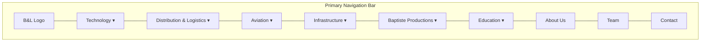
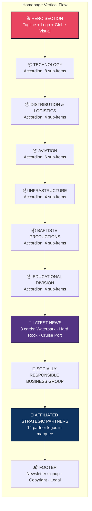
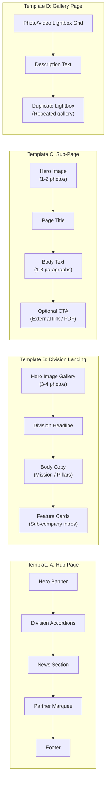
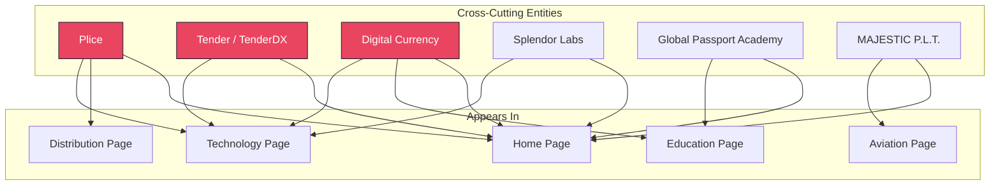

# B&L Worldwide — Website Information Architecture

> **Purpose**: This document is the definitive blueprint for rebuilding the B&L Worldwide corporate website. It maps every page, its content purpose, its parent-child relationship in the navigation tree, and the image assets it consumes. All data is derived from the 33 extracted WordPress content pages.

---

## 1. Brand Identity & Positioning

| Attribute | Value |
|---|---|
| **Company** | B & L Worldwide Holding Companies |
| **Tagline** | "Distribution Logistics and technology that connect continents" |
| **Sub-tagline** | "Invest Locally, Think Globally — Customized Business Solutions" |
| **HQ** | 1314 East Las Olas Blvd, Ft Lauderdale, FL 33301 |
| **Phone** | (561) 400-0465 |
| **Email** | info@b-lworldwide.company |
| **Regions** | Americas, Caribbean, Africa, Europe, Asia |

---

## 2. High-Level Site Map

The site is organized as a **Hub & Spoke** model: a central homepage acts as a switchboard into **6 core business divisions**, each with its own landing page and 2–8 child pages. Utility pages (About, Team, Contact) sit outside the divisions.

```mermaid
graph TD
    HOME["🏠 HOME"]

    HOME --> TECH["💻 Technology"]
    HOME --> LOGISTICS["🚚 Distribution & Logistics"]
    HOME --> AVIATION["✈️ Aviation"]
    HOME --> INFRA["🏗️ Infrastructure & Development"]
    HOME --> PRODUCTIONS["🎬 Baptiste Productions"]
    HOME --> EDUCATION["🎓 Educational Division"]

    HOME --> ABOUT["ℹ️ About Us"]
    HOME --> TEAM["👥 Meet Our Team"]
    HOME --> CONTACT["📞 Contact"]
    HOME --> MULTILINGUAL["🌐 Multilingual"]

    %% Technology Children
    TECH --> TENDER["Tender"]
    TECH --> DIGICURR["Digital Currencies"]
    TECH --> PLICE["Plice"]
    TECH --> SPLENDOR["Splendor"]

    %% Logistics Children
    LOGISTICS --> ILTT["ILTT"]
    LOGISTICS --> FRESH24["24 Fresh"]
    LOGISTICS --> DUTYFREE["Duty Free"]

    %% Aviation Children
    AVIATION --> AIRCARGO["Majestic Air Cargo"]
    AVIATION --> FLTTRAIN["Aerospace Flight Training"]
    AVIATION --> ATC["Air Traffic Control Training"]
    AVIATION --> VTOL["VTOL / Drones"]
    AVIATION --> AVIONICS["Avionics & Power Plant"]
    AVIATION --> MRO["MRO"]

    %% Infrastructure Children
    INFRA --> PORT["Port & Hotel Development"]
    INFRA --> MIXED["Mixed Use Residential"]
    INFRA --> HOUSING["Affordable / VA / HUD Housing"]
    INFRA --> FOOD["Food & Beverage (Dee Lincoln)"]

    %% Productions Children
    PRODUCTIONS --> MOVIES["Movies (Captain Bronn)"]
    PRODUCTIONS --> DOCS["Documentaries (Afro Excelencia)"]
    PRODUCTIONS --> SERIES["Series"]
    PRODUCTIONS --> COMMERCIALS["Commercials & Campaigns"]

    %% Education Children
    EDUCATION --> GPA["Global Passport Academy"]
    EDUCATION --> AVIATIONSIM["Aviation Simulator"]
    EDUCATION --> AI["AI"]
    EDUCATION --> FINANCE["Digital Currency & 21st Century Finance"]

    style HOME fill:#1a1a2e,stroke:#e94560,color:#fff,stroke-width:3px
    style TECH fill:#16213e,stroke:#0f3460,color:#fff
    style LOGISTICS fill:#16213e,stroke:#0f3460,color:#fff
    style AVIATION fill:#16213e,stroke:#0f3460,color:#fff
    style INFRA fill:#16213e,stroke:#0f3460,color:#fff
    style PRODUCTIONS fill:#16213e,stroke:#0f3460,color:#fff
    style EDUCATION fill:#16213e,stroke:#0f3460,color:#fff
```



---

## 3. Navigation Menu Structure

The main navigation is a **mega-menu** with 6 division dropdowns plus utility links.



### Dropdown Contents

| Menu Item | Dropdown Sub-Items |
|---|---|
| **Technology** | Tender · Digital Currencies · Plice · Nanocar · Splendor · Surface Wise · Splendor AI Studio · Deck Splendor |
| **Distribution & Logistics** | ILTT · Plice · 24 Fresh · Duty Free |
| **Aviation** | Majestic Air Cargo · Aerospace Flight Training · Air Traffic Control · VTOL/Drones · Avionics & Power Plant · MRO |
| **Infrastructure & Development** | Port & Hotel Development · Mixed Use Residential · Affordable/VA/HUD Housing · Food & Beverage (Dee Lincoln) |
| **Baptiste Productions** | Movies · Documentaries · Series · Commercials & Campaigns |
| **Educational Division** | Global Passport Academy · Aviation Simulation · AI · Digital Currency & 21st Century Finance |

---

## 4. Page Inventory — Complete Manifest

Every page that exists in the extracted content, its role, and the markdown source file.

### 4.1 Global / Utility Pages

| Page | Source File | Purpose | Content Type |
|---|---|---|---|
| **Home** | [page_home.md](file:///c:/AGY-Projects/B&L%20WorldWide/docs/website_content/page_home.md) | Corporate switchboard · Hero · 6 Division accordions · News · Partners | Hub |
| **About Us** | [page_about-us.md](file:///c:/AGY-Projects/B&L%20WorldWide/docs/website_content/page_about-us.md) | Mission, Vision, Our Reach, Portfolio of Excellence (6 division summaries) | Informational |
| **Meet Our Team** | [page_meet-our-team.md](file:///c:/AGY-Projects/B&L%20WorldWide/docs/website_content/page_meet-our-team.md) | 14 executive bios with photos | Team |
| **Contact** | [page_contact.md](file:///c:/AGY-Projects/B&L%20WorldWide/docs/website_content/page_contact.md) | Phone, email, address, embedded Google Map | Form |
| **Multilingual** | [page_multilingual.md](file:///c:/AGY-Projects/B&L%20WorldWide/docs/website_content/page_multilingual.md) | Language selector / i18n gateway | Utility |

---

### 4.2 Division: Technology

| Page | Source File | Purpose |
|---|---|---|
| **Technology** (Landing) | [page_technology.md](file:///c:/AGY-Projects/B&L%20WorldWide/docs/website_content/page_technology.md) | Division overview · Digital Currency strategy · Core Innovations |
| Tender | [page_tender.md](file:///c:/AGY-Projects/B&L%20WorldWide/docs/website_content/page_tender.md) | TenderDX payment tech product |
| Digital Currencies | [page_e281a0digital-currencys.md](file:///c:/AGY-Projects/B&L%20WorldWide/docs/website_content/page_e281a0digital-currencys.md) | Blockchain & crypto initiative |
| Plice | [page_plice.md](file:///c:/AGY-Projects/B&L%20WorldWide/docs/website_content/page_plice.md) | E-commerce / logistics tech platform |
| Splendor | [page_splendor.md](file:///c:/AGY-Projects/B&L%20WorldWide/docs/website_content/page_splendor.md) | Splendor Labs blockchain infra |

> [!NOTE]
> **Nanocar**, **Surface Wise**, **Splendor AI Studio**, and **Deck Splendor** appear only as accordion items on the homepage linking to external URLs or PDFs. They do not have dedicated internal content pages.

---

### 4.3 Division: Distribution & Logistics

| Page | Source File | Purpose |
|---|---|---|
| ILTT | [page_iltt.md](file:///c:/AGY-Projects/B&L%20WorldWide/docs/website_content/page_iltt.md) | International Liquor & Tobacco Trading (links to PDF) |
| 24 Fresh | [page_fresh-24.md](file:///c:/AGY-Projects/B&L%20WorldWide/docs/website_content/page_fresh-24.md) | Fresh produce logistics program |
| Duty Free | [page_duty-free.md](file:///c:/AGY-Projects/B&L%20WorldWide/docs/website_content/page_duty-free.md) | Duty-free retail distribution |

> [!IMPORTANT]
> There is **no dedicated landing page** for the Distribution & Logistics division. On the original site, this content lived entirely on the homepage accordion. For the rebuild, a dedicated landing page should be created.

---

### 4.4 Division: Aviation

| Page | Source File | Purpose |
|---|---|---|
| **Aviation** (Landing) | [page_aviation.md](file:///c:/AGY-Projects/B&L%20WorldWide/docs/website_content/page_aviation.md) | Division overview · MAJESTIC P.L.T. pillars |
| Majestic Air Cargo | [page_air-cargo.md](file:///c:/AGY-Projects/B&L%20WorldWide/docs/website_content/page_air-cargo.md) | Air freight operations |
| Aerospace Flight Training | [page_aerospace-flight-training-and-mentoring.md](file:///c:/AGY-Projects/B&L%20WorldWide/docs/website_content/page_aerospace-flight-training-and-mentoring.md) | Pilot training & mentorship |
| Air Traffic Control | [page_air-traffic-controilers.md](file:///c:/AGY-Projects/B&L%20WorldWide/docs/website_content/page_air-traffic-controilers.md) | ATC training program |
| VTOL / Drones | [page_vtol-drone-pilotless-vehicles.md](file:///c:/AGY-Projects/B&L%20WorldWide/docs/website_content/page_vtol-drone-pilotless-vehicles.md) | Autonomous vehicle division |
| Avionics & Power Plant | [page_avionics-air-frame-fabrication-and-power-plant.md](file:///c:/AGY-Projects/B&L%20WorldWide/docs/website_content/page_avionics-air-frame-fabrication-and-power-plant.md) | Airframe fabrication & repair |
| MRO | [page_maintenance-repair-operations.md](file:///c:/AGY-Projects/B&L%20WorldWide/docs/website_content/page_maintenance-repair-operations.md) | Maintenance, Repair & Overhaul |

---

### 4.5 Division: Infrastructure & Development

| Page | Source File | Purpose |
|---|---|---|
| Port & Hotel Development | [page_port.md](file:///c:/AGY-Projects/B&L%20WorldWide/docs/website_content/page_port.md) | Maritime ports, waterfront hospitality, lightbox gallery |
| Mixed Use Residential | [page_mixed-use-residential.md](file:///c:/AGY-Projects/B&L%20WorldWide/docs/website_content/page_mixed-use-residential.md) | Real estate development |
| Affordable / VA / HUD | [page_affordable-va-hud-housing.md](file:///c:/AGY-Projects/B&L%20WorldWide/docs/website_content/page_affordable-va-hud-housing.md) | Government & veteran housing |
| Food & Beverage (Dee Lincoln) | [page_dee-lincoln-prime.md](file:///c:/AGY-Projects/B&L%20WorldWide/docs/website_content/page_dee-lincoln-prime.md) | Dee Lincoln Prime steakhouse |

> [!IMPORTANT]
> There is **no dedicated landing page** for the Infrastructure division. Like Distribution, it only existed as a homepage accordion. A landing page should be created for the rebuild.

---

### 4.6 Division: Baptiste Productions

| Page | Source File | Purpose |
|---|---|---|
| **Film Production** (Landing) | [page_film-production.md](file:///c:/AGY-Projects/B&L%20WorldWide/docs/website_content/page_film-production.md) | Division overview · Captain Bronn · Afro Excelencia · Photo gallery |
| Documentaries | [page_documentaries.md](file:///c:/AGY-Projects/B&L%20WorldWide/docs/website_content/page_documentaries.md) | Afro Excelencia documentary |
| Series | [page_series.md](file:///c:/AGY-Projects/B&L%20WorldWide/docs/website_content/page_series.md) | Television series content |
| Commercials & Campaigns | [page_commercial-and-campaigns.md](file:///c:/AGY-Projects/B&L%20WorldWide/docs/website_content/page_commercial-and-campaigns.md) | Advertising campaigns |

---

### 4.7 Division: Educational

| Page | Source File | Purpose |
|---|---|---|
| Global Passport Academy | [page_global-passport-academy-gpa.md](file:///c:/AGY-Projects/B&L%20WorldWide/docs/website_content/page_global-passport-academy-gpa.md) | Language learning platform · AI tutor "Amira" · University partnerships |
| Aviation Simulator | [page_aviation-simulator.md](file:///c:/AGY-Projects/B&L%20WorldWide/docs/website_content/page_aviation-simulator.md) | Flight simulation training |
| AI | [page_ai-2.md](file:///c:/AGY-Projects/B&L%20WorldWide/docs/website_content/page_ai-2.md) | AI initiatives |
| Digital Currency & Finance | [page_digital-currency-and-21st-century-finance.md](file:///c:/AGY-Projects/B&L%20WorldWide/docs/website_content/page_digital-currency-and-21st-century-finance.md) | Fintech educational content |

> [!IMPORTANT]
> There is **no dedicated landing page** for the Educational division either. A landing page should be created.

---

## 5. Homepage Layout Architecture

The homepage is the most content-dense page. Below is the vertical section breakdown as it existed on the original site:



---

## 6. Page Template Patterns

All 33 pages follow one of **4 structural templates**:



| Template | Used By |
|---|---|
| **A: Hub** | Home |
| **B: Division Landing** | Aviation, Technology, About Us, Film Production |
| **C: Sub-Page** | Air Cargo, Flight Training, ATC, VTOL, Avionics, MRO, Tender, Digital Currencies, Plice, Splendor, ILTT, 24 Fresh, Duty Free, Mixed Use, Housing, Dee Lincoln, GPA, Aviation Sim, AI, Finance, Documentaries, Series, Commercials, Contact, Multilingual |
| **D: Gallery** | Port & Hotel Development, Film Production (photo section) |

---

## 7. Content Relationships Diagram

This shows how entities (sub-companies, brands, people) cross-reference across pages:



> [!WARNING]
> **Plice** and **Digital Currency** each appear in **two different divisions** (Technology AND Distribution/Education respectively). The rebuild should decide whether these are standalone division-agnostic brand pages or duplicated within each division's route tree.

---

## 8. Team Roster

The Meet Our Team page contains **14 executive profiles**. Each profile consists of a headshot image, a name, and a 1-paragraph bio.

| Name | Title / Domain |
|---|---|
| Captain Craig Baptiste | Aviation · 23,000+ flight hours · Embry-Riddle / USAFA |
| Mr. Ralph Ledee | Caribbean business · ILTT founder · Distribution |
| Mr. George Hazy | Aviation executive · American Eagle/Airlines |
| Lt. Col® Mauricio Zuleta | Colombian Air Force · R&D · Robotics |
| Mr. Robert Asprilla | Policy/advocacy · CEO Global Passport Academy |
| Captain Jonathan Earl Baptiste | American Airlines captain · Aviation & real estate |
| Mr. Todor Ivanov | CEO Splendor Labs · Blockchain/AI |
| Mr. Noah Ledee | Commercial pilot · Caribbean real estate |
| William L. Foley Jr. "Bill" | Food service (Cheney Brothers) · COO |
| Dr. Ngoie Joel Nshisso | Economist · DRC / African Union |
| Ngoie Yedidia Nshisso | Community builder · FICE USA VP |
| Marvin Bon | Aerospace · Space Shuttle program · Food ops |
| Michael Ruley | CEO · Private equity · BioScience |
| Julian Rodarte | Culinary Director · Dee Lincoln Concepts |
| Dee Lincoln | Founder Del Frisco's → Dee Lincoln Prime |
| Steve Orozco | Operations Director · Dee Lincoln Concepts |

---

## 9. External Link Inventory

These are outbound links to external products, partners, and resources found across pages:

| External URL | Context |
|---|---|
| `https://tenderdx.com/` | Tender product site |
| `https://ai.splendor.org` | Splendor AI Studio |
| `https://deck.splendor.org/` | Deck Splendor platform |
| `https://www.globalpassportacademy.org/` | GPA main site |
| `https://youtu.be/ht5gcqfenIY` | Surface Wise video |
| `https://www.thedailyherald.sx/...` | News article (Port approval) |
| Various PDF links | Nanocar Tech PDF, ILTT PDF, Trident Presentation PDF |

---

## 10. Image Asset Distribution by Division

| Division / Page | Image Count | Key Assets |
|---|---|---|
| **Home** | ~30 | Logos, division icons, news photos, partner logos |
| **About Us** | 8 | Hero photos, shared division illustrations |
| **Meet Our Team** | ~14 | Executive headshots |
| **Aviation (all)** | ~16 | Planes, cockpits, pilots, drones |
| **Technology** | 6 | Shared stock photos (fintech, blockchain) |
| **Film Production** | ~20 | Film stills, on-set photos, WhatsApp gallery |
| **Port & Hotel** | 6 | Lightbox renders (c1–c6) |
| **Education (GPA)** | 8 | Classroom, laptop, cultural immersion |
| **Infrastructure** | 4 | Housing, mixed-use renders |
| **Distribution** | 4 | Product logos, fresh produce |
| **Shared** | 11 | Re-used across multiple division pages |

---

## 11. Gaps & Recommendations for the Rebuild

> [!CAUTION]
> The following architectural issues were present in the original WordPress site and should be corrected in the rebuild.

| Issue | Recommendation |
|---|---|
| **No Division Landing Pages** for Distribution, Infrastructure, Education | Create 3 new landing pages matching the Aviation/Technology template |
| **Duplicate content** — Plice appears under both Technology and Distribution | Consolidate into a single brand page with cross-links from both divisions |
| **Digital Currency** appears in both Technology and Education | Same as above — single page, dual cross-links |
| **No blog/news system** — News was hardcoded HTML | Implement a headless CMS or structured data source for news articles |
| **Team photos served via WordPress shortcodes** (`[iheu_ultimate_oxi id="X"]`) | These shortcodes rendered circular avatar widgets. You will need actual headshot image files |
| **No 404 page** | Create a branded 404 page |
| **No search functionality** | Add site-wide search capability |
| **Multilingual page is a stub** | Implement proper i18n with language toggle |
| **Film Production page has duplicate lightbox galleries** | The same 15 photos are listed twice in the source. De-duplicate |
| **Partner logos section** has 14 logos but no alt-text or names | Add proper partner identification and links |

---

## 12. Recommended Route Structure for New Stack

```
/                           → Home
/about                      → About Us
/team                       → Meet Our Team
/contact                    → Contact
/technology                 → Technology Landing
/technology/tender          → Tender
/technology/digital-currency → Digital Currencies
/technology/plice           → Plice
/technology/splendor        → Splendor
/distribution               → Distribution & Logistics Landing (NEW)
/distribution/iltt          → ILTT
/distribution/24-fresh      → 24 Fresh
/distribution/duty-free     → Duty Free
/aviation                   → Aviation Landing
/aviation/air-cargo         → Majestic Air Cargo
/aviation/flight-training   → Aerospace Flight Training
/aviation/atc               → Air Traffic Control
/aviation/vtol-drones       → VTOL / Drones
/aviation/avionics          → Avionics & Power Plant
/aviation/mro               → MRO
/infrastructure             → Infrastructure Landing (NEW)
/infrastructure/port        → Port & Hotel Development
/infrastructure/residential → Mixed Use Residential
/infrastructure/housing     → Affordable / VA / HUD Housing
/infrastructure/food        → Dee Lincoln Prime (Food & Beverage)
/productions                → Baptiste Productions Landing
/productions/movies         → Movies (Captain Bronn)
/productions/documentaries  → Documentaries (Afro Excelencia)
/productions/series         → Series
/productions/commercials    → Commercials & Campaigns
/education                  → Educational Division Landing (NEW)
/education/gpa              → Global Passport Academy
/education/aviation-sim     → Aviation Simulator
/education/ai               → AI
/education/finance          → Digital Currency & 21st Century Finance
/news                       → Latest News (NEW - dynamic)
```

**Total Pages**: 33 existing + 4 new landing/utility pages = **37 routes**
